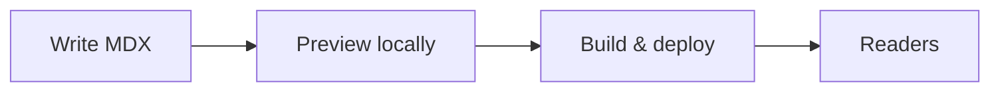

This post demonstrates what you can use in articles on this site.

## GitHub Flavored Markdown

### Tables

| Layer        | Responsibility        |
| ------------ | --------------------- |
| Content      | `.md` / `.mdx` files  |
| Rendering    | Astro + remark-gfm    |
| Diagrams     | Mermaid (client-side) |

### Task lists

- [x] Light / dark theme
- [x] RSS feed at `/rss.xml`
- [ ] Your next post

### Strikethrough and emphasis

~~Demo magic~~ **Production contracts** matter more than prompt polish.

### Footnotes

The best interfaces fail gracefully.[^1]

[^1]: Including the ones made of prose.

## Code

Inline `const x = 1` and fenced blocks:

```ts
export function slugify(title: string) {
  return title.toLowerCase().replace(/\s+/g, '-');
}
```

## Mermaid



## Blockquote

> Minimal design is not empty — it removes everything that isn't the message.

---

Add new posts anytime. If a diagram does not render, check the fence language is `mermaid` on its own line.
